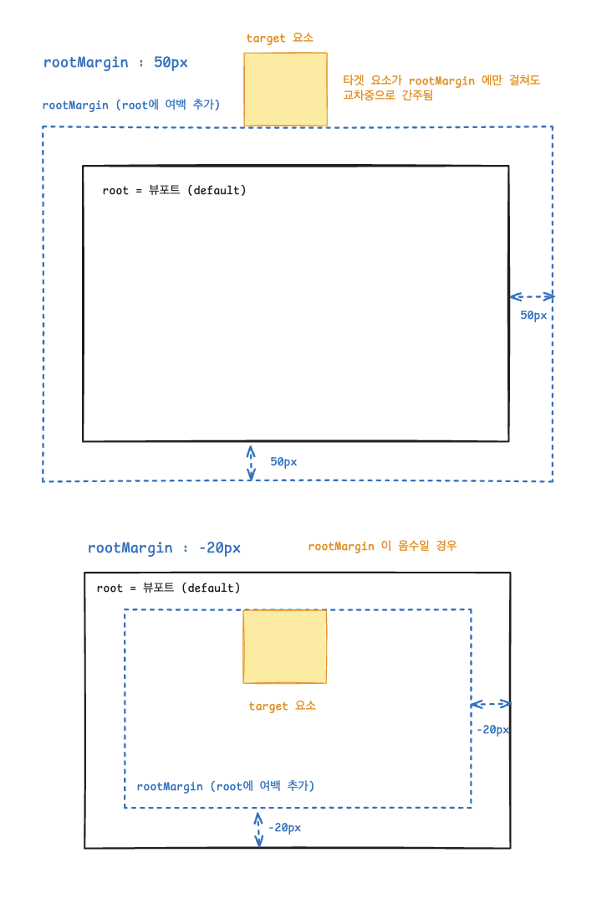
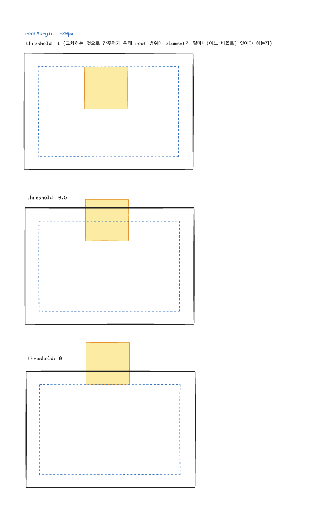

# useInfiniteScroll

`useInfiniteScroll`은 IntersectionObserver를 활용하여 무한 스크롤 기능을 구현할 수 있는 커스텀 React Hook입니다.

특정 요소가 화면에 나타날 때 자동으로 콜백 함수를 실행하여 추가 데이터를 로드하거나 다른 작업을 수행할 수 있습니다.

## 🔗 사용법

```tsx
const { targetRef, loading } = useInfiniteScroll(options);
```

### 매개변수(options)

- `callback: () => void | Promise<void>`
  - 관찰 대상이 화면에 나타났을 때 실행할 콜백 함수.
  - 동기 또는 비동기 함수를 모두 지원합니다.

- `options?: IntersectionObserverInit`
  - IntersectionObserver 설정 값 (선택사항).
  - 기본값: `{ root: null, rootMargin: '0px', threshold: 1.0 }`

### 반환값

- `targetRef: React.RefObject<T>`
  - 감시 대상에 연결할 ref 객체

- `loading: boolean`
  - 콜백 함수가 실행 중인지 나타내는 로딩 상태

## ✅ 예시

### 기본 무한 스크롤

```tsx
import { useState, useCallback } from 'react';
import { useInfiniteScroll } from './useInfiniteScroll';

function InfiniteList() {
  const [items, setItems] = useState<number[]>(Array.from({ length: 20 }, (_, i) => i + 1));

  const loadMore = useCallback(() => {
    return new Promise<void>((resolve) => {
      setTimeout(() => {
        setItems((prev) => [...prev, ...Array.from({ length: 10 }, (_, i) => prev.length + i + 1)]);
        resolve();
      }, 1000);
    });
  }, []);

  const { targetRef, loading } = useInfiniteScroll({ callback: loadMore });

  return (
    <div>
      <ul>
        {items.map((item) => (
          <li key={item} style={{ padding: 10, borderBottom: '1px solid #ccc' }}>
            아이템 #{item}
          </li>
        ))}
      </ul>
      <div ref={targetRef} style={{ height: 50, textAlign: 'center', padding: 20 }}>
        {loading ? '로딩중...' : '더 보기'}
      </div>
    </div>
  );
}
```

### 커스텀 옵션 사용

```tsx
import { useInfiniteScroll } from './useInfiniteScroll';

function CustomInfiniteScroll() {
  const loadData = async () => {
    const response = await fetch('/api/data');
    const data = await response.json();
    // 데이터 처리 로직
  };

  const { targetRef, loading } = useInfiniteScroll({
    callback: loadData,
    options: {
      root: null,
      rootMargin: '100px', // 100px 전에 미리 로딩 시작
      threshold: 0.5, // 50% 보일 때 트리거
    },
  });

  return (
    <div>
      {/* 컨텐츠 */}
      <div ref={targetRef}>{loading ? '데이터 로딩 중...' : '스크롤하여 더 보기'}</div>
    </div>
  );
}
```

### 에러 처리가 포함된 예시

```tsx
import { useState, useCallback } from 'react';
import { useInfiniteScroll } from './useInfiniteScroll';

function InfiniteScrollWithError() {
  const [items, setItems] = useState<string[]>([]);
  const [error, setError] = useState<string | null>(null);

  const fetchItems = useCallback(async () => {
    try {
      setError(null);
      const response = await fetch('/api/items');

      if (!response.ok) {
        throw new Error('데이터를 불러올 수 없습니다');
      }

      const newItems = await response.json();
      setItems((prev) => [...prev, ...newItems]);
    } catch (err) {
      setError(err instanceof Error ? err.message : '알 수 없는 오류가 발생했습니다');
    }
  }, []);

  const { targetRef, loading } = useInfiniteScroll({ callback: fetchItems });

  return (
    <div>
      {items.map((item, index) => (
        <div key={index}>{item}</div>
      ))}

      <div ref={targetRef} style={{ padding: 20, textAlign: 'center' }}>
        {loading && '로딩 중...'}
        {error && <div style={{ color: 'red' }}>{error}</div>}
        {!loading && !error && '더 보기'}
      </div>
    </div>
  );
}
```

## 📋 주요 특징

- **자동 중복 방지**: 로딩 중일 때는 추가 콜백 실행을 방지합니다
- **에러 처리**: 콜백 함수에서 에러가 발생해도 로딩 상태를 올바르게 관리합니다
- **메모리 안전**: 컴포넌트 언마운트 시 IntersectionObserver를 자동으로 정리합니다
- **유연한 설정**: IntersectionObserver의 모든 옵션을 커스터마이징 할 수 있습니다

## 🎯 IntersectionObserver 옵션

- `root`: 교차 영역의 기준이 될 요소 (기본값: viewport)
- `rootMargin`: root의 마진 값 (예: '100px')
- `threshold`: 콜백이 실행될 요소의 가시성 비율 (0.0 ~ 1.0)



